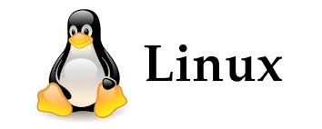

```
name: Dipali Rana
class: cis 106
semester: spring 22
```
# Deliverable 1 

<hr>

## Project Description

My project is on how to install the Apache Web Server on Ubuntu 20.04. **Apache** is a free and open source web server. Web servers are needed so that users can view web pages on websites. Web hosting is important because it allows people to post a website or web page onto the Internet, and once the website is hosted on the computer they are called servers. The purpose of the project is to install the web server to allow web developers to deliver their files on the web in a quick, secure, and reliable way. The Apache web server processes requests and serves the content via *Hypertext Transfer Protocol* (**HTTP**), which allows users to interact with the web by transmitting hypertext messages between clients and servers. 

## Project Hardware and Software Requirements
* Apache2 package
* Ubuntu 
* VirtualBox *(2 GHz quad core processor or better, 8 GB system memory, 50 GB of free hard drive space, and Internet access for installation media)*
* Linux
* Debian

## What is Linux?



Linux is a popular operating system and is an open source software meaning that users can customize and modify the software. The OS is free of charge and is highly scalable and customizable. It contains the kernel, libraries, and utilities, and includes lots of Unix tools that contain important programs and programming languages. Many distributions are available in Linux like Debian, Fedora, Red Hat, Ubuntu to name a few. Many businesses and companies rely on Linux because it can be installed any system as it supports almost every processor architecture and is a very stable and most server applications on the internet run on Linux. 


### Short History of Linux

 
Linus Torvalds, the founder of Linux. 

| Year | Events                                                                                                     |
| ---- | ---------------------------------------------------------------------------------------------------------- |
| 1991 | Linus Torvalds developed and worked on Linux when he was a student at the University of Helsinki in Finland. He maintained the Linux kernel where this was the lowest-level core component of the operating system      |
| 1992 | Linus released the next version (Linux 0.12) under the GNU General Public License                          |
| 1993 | Slackware and Debian released their 1st version of their distributions                                                                                                       |
| 1994 | Version 1.0 of the Linux kernel was released and Red Hat & SUSE published their versions of distributions                                                                                                       |
| 1995 | Linux is ported to the DEC Alpha and to the Sun SPARC                                                      |
| 1996 | Version 2.0 of the Linux kernel is released and it can now serve several processors at the same time using multiprocessing                                                                                                     |
| 1998 | Many companies, like IBM and Oracle, announced their support for Linux. A group of programmers began to work work for the graphical user interface once Netscape publicly displayed the source code to its Netscape Communicator web browser suite                                                                                      |
| 1999 | GNOME, the desktop environment was created in several major distributions ike Fedora, Debian, Red Hat, SUSE                                                                                                                |
| 2000 | Dell announced that it is the number 2 provider of the Linux-Based system                                                                                                              |
| 2006 | Oracle releases its own distribution of Red Hat Enterprise.                                                |

### Linux Distribution
* **Slackware**: Slackware Linux by Patrick Volkerding is an advanced Linux operating system, designed with the twin goals of ease of use and stability. Slackware Linux provides new and experienced users alike with a fully-featured system, equipped to serve in any capacity from desktop workstation to machine-room server. 
  
* **Debian**: Debian is an all-volunteer organization dedicated to developing free software and promoting the ideals of the Free Software community. 

> **Debian Based Linux Distributions** 
> Ubuntu is a Linux distribution that is free, customizable, and have the belief that they can use use their software as they see fit in whatever programming language that they are comfortable with. 
> Kali Linux is a Debian-based distribution with a collection of security and forensics tools. It features timely security updates, support for the ARM architecture, a choice of four popular desktop environments, and seamless upgrades to newer versions.

* **Red Hat Enterprise Linux**: Red Hat Enterprise Linux is a Linux distribution developed by Red Hat and targeted toward the commercial market. Red Hat Enterprise Linux is released in server editions for x86, x86_64, Itanium, PowerPC and IBM System z architectures, and desktop editions for x86 and x86_64 processors. Third-party derivatives can be built and redistributed by stripping away non-free components.
> Fedora is a Linux distribution developed by the community-supported Fedora Project and owned by Red Hat. The default desktop in Fedora Linux is the GNOME desktop environment and the default interface is the GNOME Shell. The Fedora project also distributes custom variations of Fedora called Fedora spins. These are built with specific sets of software packages, offering alternative desktop environments or targeting specific interests such as gaming, security, design, scientific computing and robotics. 

## Open Source VS Closed Source

Open source is giving power to consumers and users to modify existing software and sharing that knowledge with other people. The user would have the flexibility to make the product work for them better if they have access to the manufacturing and development information (i.e. source code) of the software. Hence, the license is shared of that software. 

Closed source is proprietary meaning that the companies or business have full control and ownership of the software. They own the source code so the public would not have access to that information. Furthermore, the consumer would not be able to tinker with the software and rely on the company for fixes, security, etc. 

### Advantages/Disadvantages of Open Source

| **Advantage**                                         | **Disadvantage**                                          |
| ----------------------------------------------------- | --------------------------------------------------------- |
|  Allows the device or software work for them in terms of fixes, repairs, and adding in features that would help with security.                                          | If the device breaks because of the fix, the consumer would be out of luck and would have to buy another device.                                                                                                             |
| You can share the information with people and technology progresses through that innovation. | If the software is expensive, it might deter customers from purchasing the product.                     |
| Free to use or low cost.                              | If working in an organization that uses open source, the person must be tech-savvy because costs could go down if the product is not user-friendly.                          |
| Open source is reliable and scalable.                 | While there are a lot of users who use open-source for their projects, it can be a security issue if the information is in the wrong hands. Malicious wrong-doing like identity and data theft and hacking are prevalent.                                                                  |

### Advantages/Disadvantages of Closed Source

| **Advantage**                                         | **Disadvantage**                                          |
| ----------------------------------------------------- | --------------------------------------------------------- |
| The software is user-friendly because it is targeted to a larger audience so the product must be easy to use. Information on how to use the product is shared via user manuals and through support services. | The user would not be able to modify the software to repair their item if the product does not work or is broken.                      |
| Because of the large base, the software is much more secure than open source | If the user wants more security features, they need to wait for the manufacturing company to update them.                                           |
| Reliability of the software and the ability of troubleshooting appeases customers in that the company is solely responsible for the source code. Thus, if something is wrong with the product or device, they can go to the company for that fix                                           | The cost of the product may be expensive varied based on features and additions, or the device itself because of the manufacturer responsible for the production of that item. Plus, it can be added costs for repairs which might affect the consumer's decision on buying the item.       |


## Sources
* https://distrowatch.com/
* https://www.techradar.com/news/a-comprehensive-history-of-the-pc/9
* https://www.digitalocean.com/community/tutorials/how-to-install-the-apache-web-server-on-ubuntu-20-04
* https://docs.google.com/presentation/d/e/2PACX-1vR3UotysXXgp_0PlcYxxAeA2JKK_Tat7PIxTzBLh9M5ZGeMSuNJrOvZ5-eJvWSDmUb0PtsRFxBF4nJP/pub?start=false&loop=false&delayms=3000&slide=id.g86fa6133bc_4_20918
* https://www.hitechwhizz.com/2021/05/6-advantages-and-disadvantages-drawbacks-benefits-of-open-source-software.html
* https://www.hitechwhizz.com/2021/05/6-advantages-and-disadvantages-drawbacks-benefits-of-closed-source-software.html
  
## The Free Software Movement

The Free Software Movement is for computer users to have the freedom to openly share information and the license to take part in open-source projects. The GNU project played a big part in the free software movement. Many people, particularly in the tech industry and some hobbyists, wanted to change software to improve existing methods. In that way, technology has progressed through collaboration and team work, and lives were improved because they made the software work for them for the better. To emphasize, this movement had built out a community that wanted to help make a difference in tech. 
