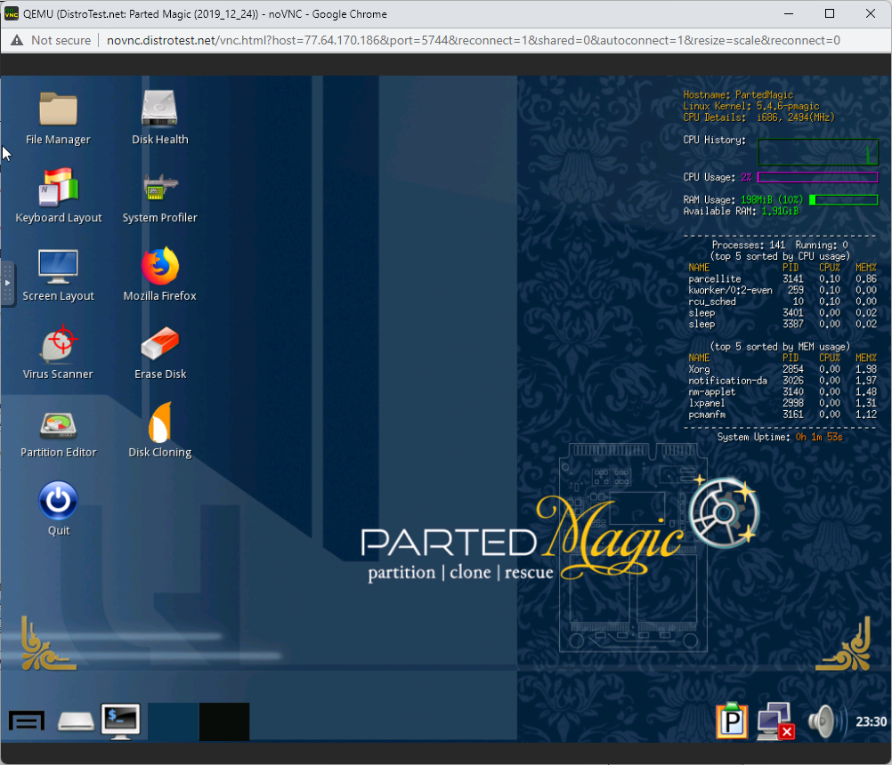
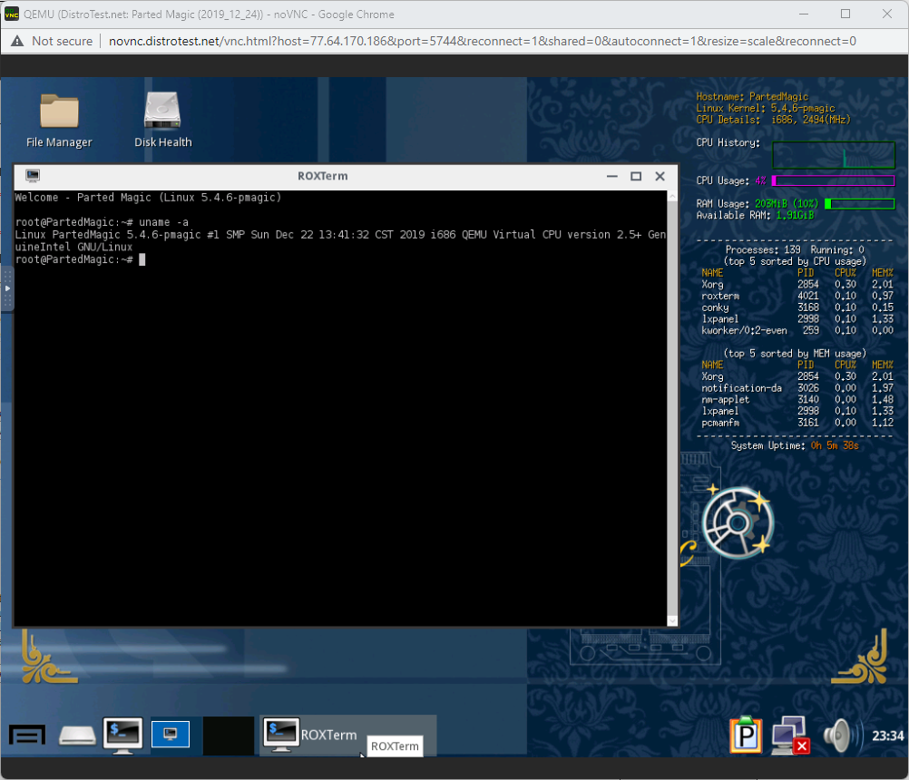
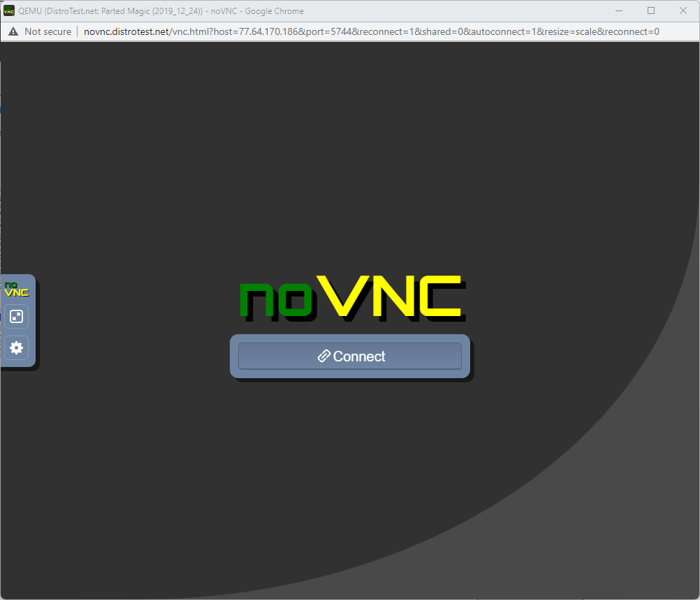

```
Name: Dipali Rana
Course: CIS106
```

# Lab 1 Exploring Linux distributions 

## Question 1
1. What is the OS Type: **Linux**
2. Which major distro is it based on? **Debian**
3. Which processor architecture does it support? **armhf, ppc64el, riscv, s390x, x86_64**
4. Is the distribution active or is it discontinued? **Active**
5. What is the distro’s home page? **https://www.ubuntu.com/**

## Question 2
1. What is the name of the distribution and the OS Type: **Distribution Name: Hyperbola & OS Type: Linux**
2. Which major distro is it based on? **Arch**
3. Which processor architecture does it support? **i686, x86_64**
4. Is the distribution active or is it discontinued? **Active**
5. What is the distro’s home page? **https://www.hyperbola.info/**

## Question 3
1. What is the name of the distribution? **Fedora**
2. What is the country of Origin? **USA**
3. What major distribution is it based on? **Independent**
4. What is the distribution category? **Desktop, Server, Live Medium**
5. Which processor architecture, aside from the one in the original query, does the OS support? **aarch64, armhfp**

## Question 4 
### A Linux distribution used for Data Rescue/Data recovery

| Distro Name   | Website                       | Desktop Environment      |
|---------------|-------------------------------|--------------------------|
| Parted Magic  | https://partedmagic.com/      | Xfce                     |

### A Linux distribution used for Education that supports the ix86 processor architecture.

| Distro Name   | Website                       | Desktop Environment      |
|---------------|-------------------------------|--------------------------|
| Karoshi       | https://www.linuxschools.com/ |  Xfce                    | 

### A Linux distribution that supports the OEM installation method

| Distro Name   | Website                       | Desktop Environment      |
|---------------|-------------------------------|--------------------------|
| Ubuntu Budgie | https://ubuntubudgie.org/     | Budgie                   |                    

## Question 5

The Linux distro that caught my attention was Zephix which I found to be really fascinating. Zephix is a live linux operating system that is based on Debian 10 (Buster). It runs from a removable media, such as DVD & USB, without touching any files stored on the user's system disk. This means that the user can run Zephix on any laptop through that medium. Furthermore, the user can make configurations & modifications to the software by saving it to the USB device. What is even better is that whatever changes the user makes, it will automatically become available the next time the computer reboots with the removable media. This operating system is really useful because of its portability and ease of use through removable media.  

## Question 6

DistroTest.net is a project that allows you to test Linux/BSD distributions on your web browser. This website is great for trying out distributions before you even download the ISO file. Go to Distrotest.net and click on any of the distributions. Start the distribution and take a screenshot of the browser window that just popped up.



Locate the terminal application in the distribution you started and type the following command: uname -a Take a screenshot of the browser window showing the terminal application open.



Stop the machine and take a screenshot of the browser window showing that the machine has been stopped.

