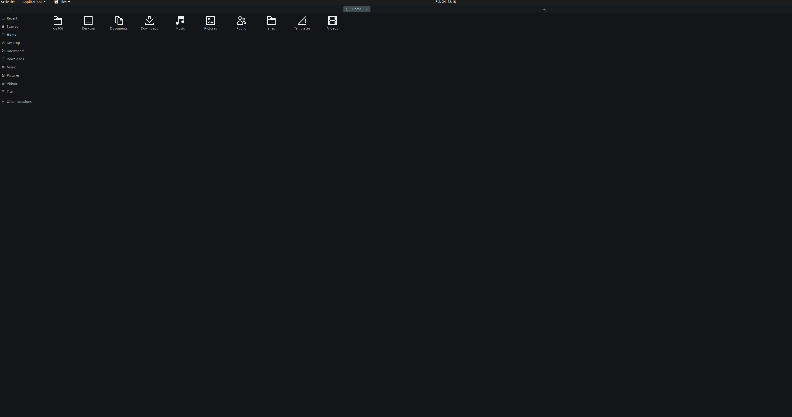

```
Name: Dipali Rana
Class: cis106
Semester: Spring 22
```

# Lab 3 Using Ubuntu

# Question 1



# Question 2


# Question 3 


| Program purpose     | Package Name    |        Version     |                   Description                           |
| ------------------- | --------------- | -------------------| ------------------------------------------------------- |
| Play a tetris game  | cuyo            |  2.0.0brl1-3build2 | Tetris-like game with very impressive effects           |              
| Play a video file   | vlc-plugin-base |  3.0.9.2-1         | multimedia player and streamer (base plugins)           |
| Browse the internet | alice           |  0.19-2 all        | Web browser (WebKit or Gecko) based IRC client          |                                              
| Read your email     | geary           |  3.36.1-1          | lightweight email client designed for the GNOME desktop |                                               
| Play music          | openmpt123      |  0.4.11-1build1    | module music library based on OpenMPT -- music player   |

Commands Answers:
* Sub Question 1: **sudo apt install**
* Sub Question 2: **remove 'package name here'** 
* Sub Question 3: **sudo apt install package+ package-**

# Question 4

| command | what it does                                                   |
|---------|--------------------------------------------------------------- |
| echo    | display a line of text                                         |
| fortune | print a random, hopefully interesting, adage                   |
| cowsay  | configurable speaking/thinking cow                             |
| lolcat  | rainbow coloring for text                                      |
| figlet  | display large characters made up of ordinary screen characters |                                             
| toilet  | display large colourful characters                             |
| rig     | Random Identity Generator                                      |       
