```
name: Dipali 
class: cis106
semester: spring 22
```


# Lab 4 | The Linux Filesystem 

## Question 1

### Table 1

| Directory | Function                                                                                 |
| --------- | --------------------------------------------------------------------------------------   |
| bin       | has the essential commands that includes many commands, scripts, and executable files    |
| dev       | provide device files                                                                     |
| etc       | has system configuration files, which can be edited by a text editor                     |
| home      | contains a home folder for each user. It contains the user's data file and        user-specific configuration files             
| media     | mount point for removable media, such as DVDs and floppy disks                           |
| opt       | add-on software packages that are optional                                               |
| proc      | contains kernel information, process control, system hardware information                |
| srv       | contains information relating to services that run on the system                         |
| usr       | software not essential for system operation, such as applications                        |

### Table 2 

| Command   | What it does                                      | Syntax               | Example       |
| --------- | ------------------------------------------------- | -------------------- | ------------- |
| cd        | used for changing the current working directory   | cd + destination     | cd Downloads  |
| pwd       | displays the current working directory            | pwd                  |  type pwd on command line and it shows current directory in the next line like /home/jdoe                                                                                                   |
| ls        | used for listing the content of a given directory or the file/directory itself | ls + directory name | ls ~/practicels | 

## Question 2

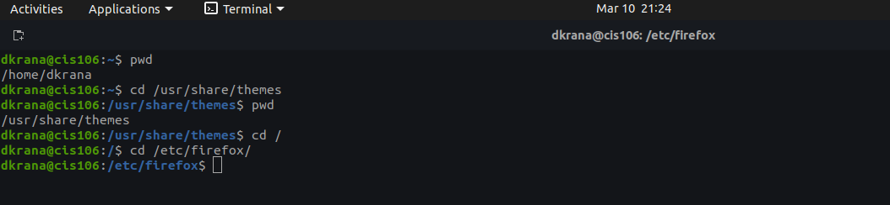

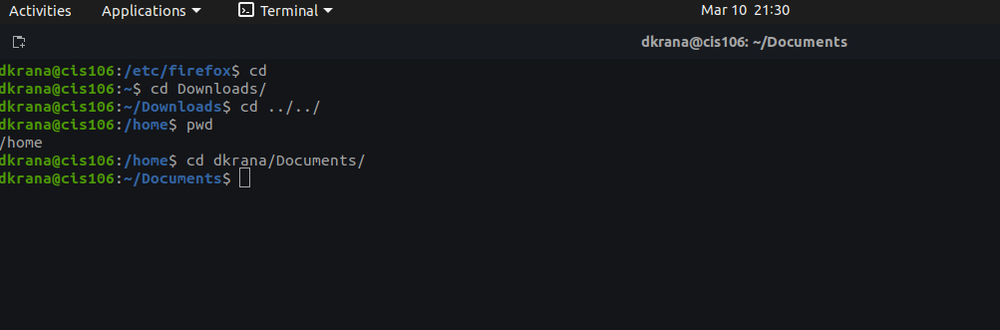

## Question 3 

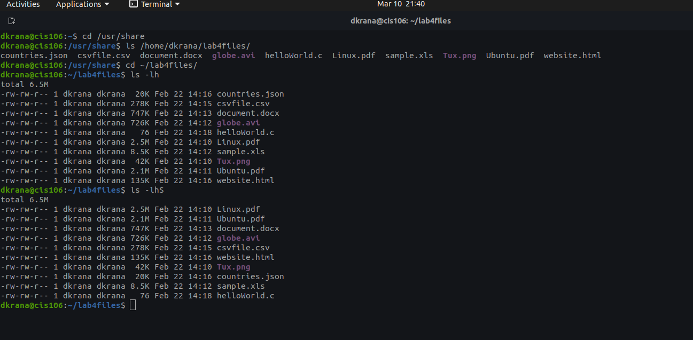

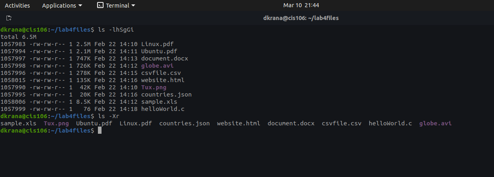)

## Question 4
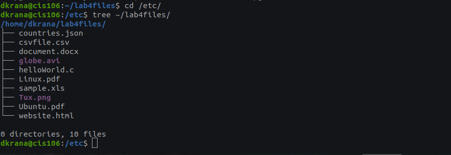

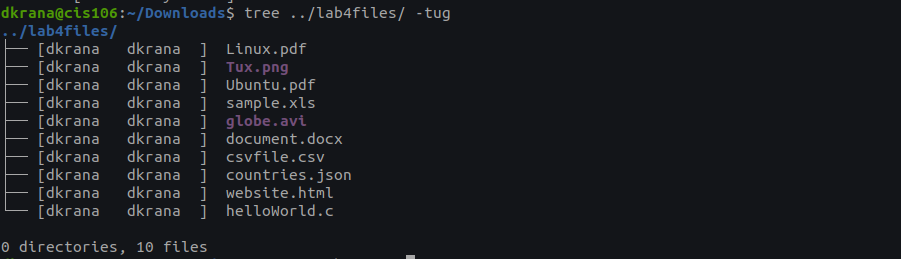

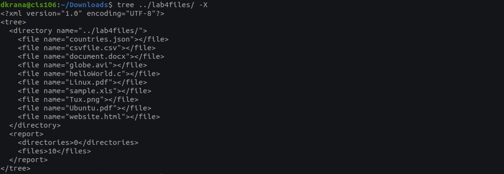

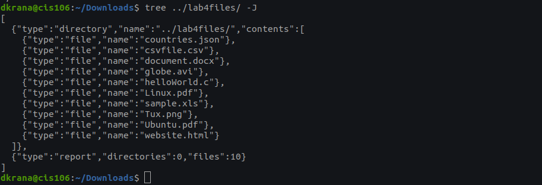

## Question 5 
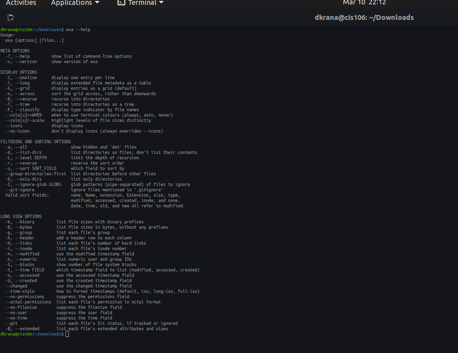

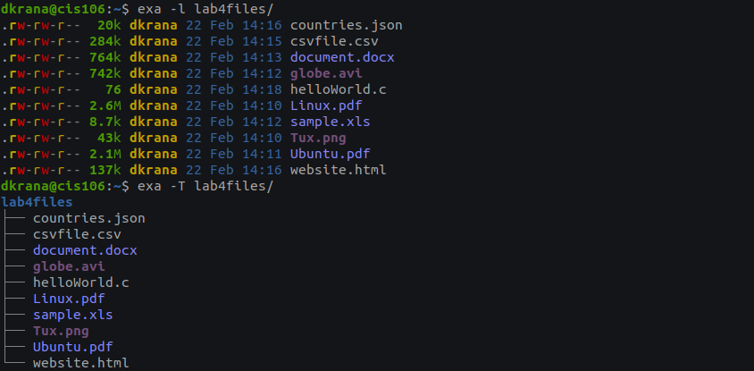

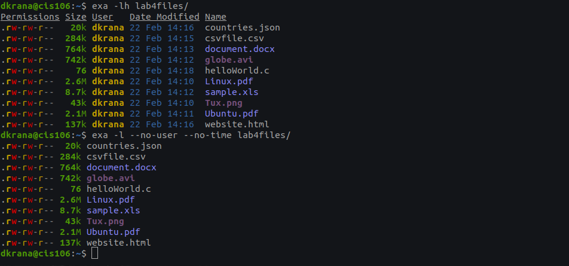
