# Week Report 2
## Summary of Presentations
### The Basics of Virtualization 
#### What is Virtualization?
**Virtualization** - replication of hardware to simulate a virtual machine inside a physical machine
#### Types of Virtualization
* Server-side virtualization 
* Client-side virtualization
* The basic difference between the two is **where the virtualizing takes place**

##### Server-side virtualization 
Virtual Desktop Infrastructure (VDI)
* Thick client or fat client
* Thin client 
* Zero client

##### Client-side virtualization
* Software installed on a computer to manage virtual machines
* For client-side virtualization, the computer needs:
  * **hypervisor** - software that allows the management of virtual machines)
  * Hardware support
    * capable CPU
    * enough RAM & storage

###### Type 1 vs Type 2 Hypervisor
* **Type 1** - runs on the hardware
* **Type 2** - runs on a host operating system

#### Benefits of Virtualization 
* Allows running multiple OSs on one machine
* Allows applications to be tested before installing them on a host machine
* Reduces costs by decreasing the physical hardware that must be purchased for a network
* Offers the chance to experiment with untested programs without infecting host machines with viruses or other malware

#### VirtualBox
**Virtualbox** - is a powerful type 2 virtualization product for enterprise as well as home use

#### Computer Virtualization Requirements
* AMD V or INTEL V compatible processor
* Dual core x64 processor with 1.3 GHz or faster 4GB of RAM
* Enough free hard drive space for installing guest OSs. 

### Installing Ubuntu in Virtualbox 

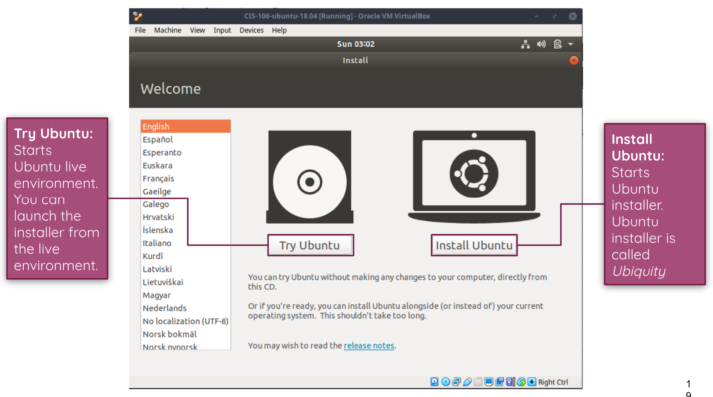

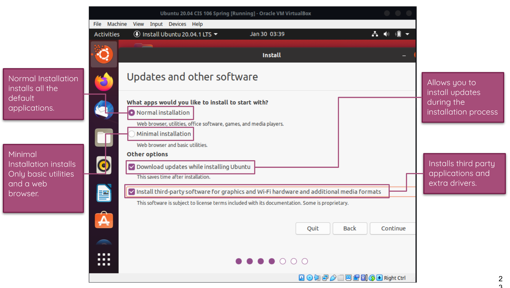

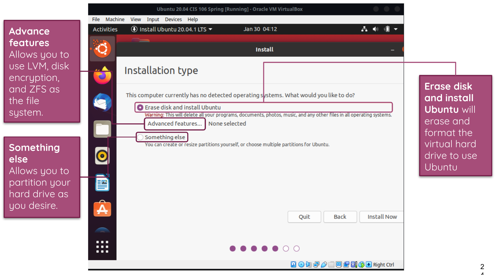

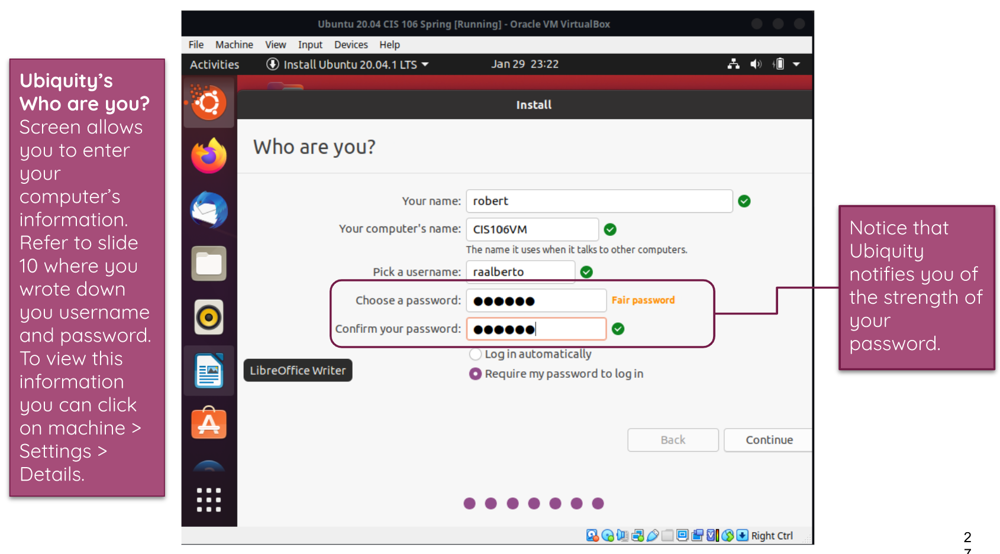

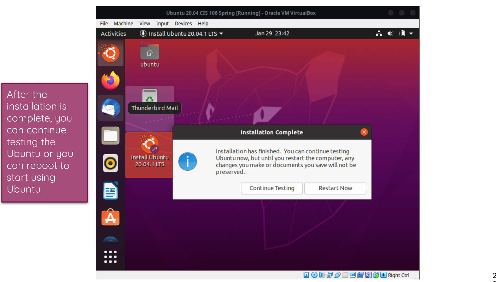

### What is Raspberry Pi? 
* Raspberry PI - a low cost, credit-card sized computer that plugs into a computer monitor or TV, and uses a standard keyboard and mouse. 

#### Raspberry Pi Foundation 
* The Raspberry Pi Foundation is a registered educational charity based in the UK, and their goal was to advance education in the field of computer science and related subjects. 

#### Different Models of Raspberry Pi

* **Raspberry Pi 4** 

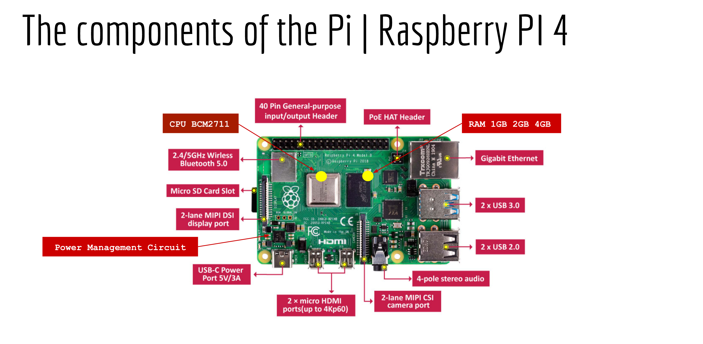 

* **Raspberry Pi 3** 

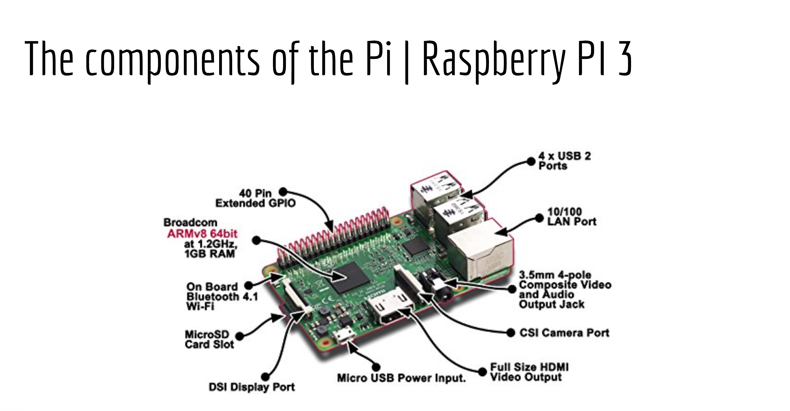

* **Pi Zero W** 

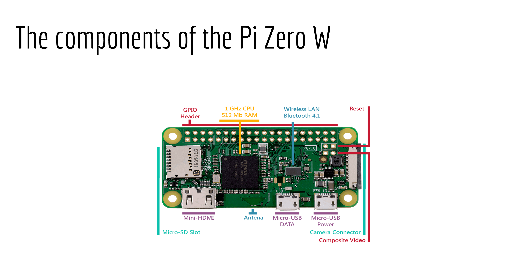

* **Pi 3 A+** 

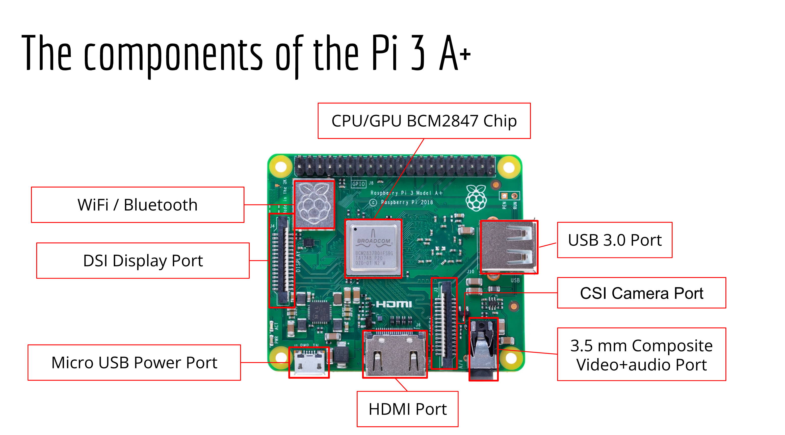

* **Raspberry Pi 400**
  * Has the same components as Raspberry Pi 4 placed inside a keyboard housing
  * Great choice for those who will be using Pi as an everyday computer.

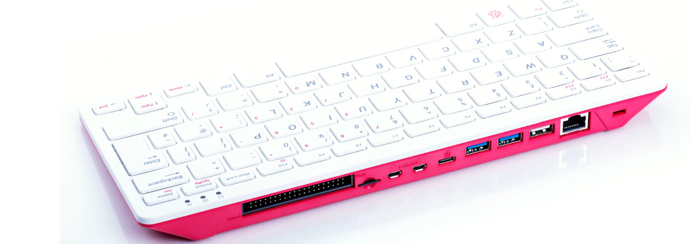

#### First Model of Raspberry Pi

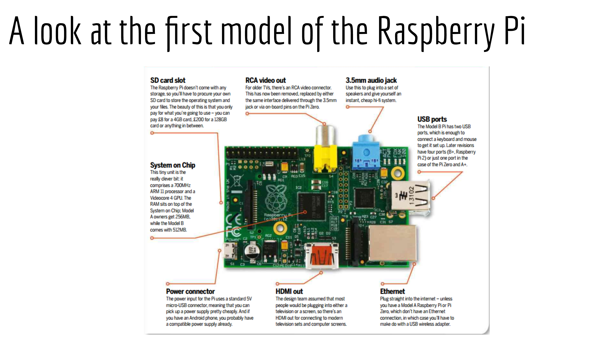

#### Hardware That Is Needed for Raspberry Pi...

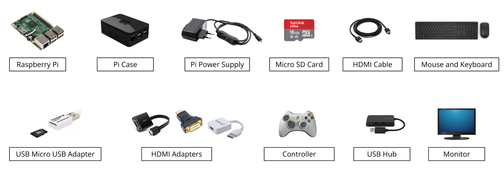

**Main Components are:**
* Raspberry Pi
* Pi Case
* Pi Power Supply
* Micro SD Card
* HDMI Cable

#### Software That Is Needed for Raspberry Pi...
* Raspberry Pi Imager

#### Different Operating System for Raspberry Pi
* Ubuntu
* Kali Linux
* Diet Pi
* Arch Linux
* Elementary OS
* Manjaro
* Windows 10
* Android

#### Installation
* [Installing Ubuntu in Raspberry Pi](https://www.youtube.com/watch?v=Lza1WWH9CYg)

#### 5 Projects You Can Do With Raspberry Pi
* Build a network game server
* Build a personal cloud
* Add a button to your Pi
* Make an old printer wireless
* Build a media center that plays files from a file server or media server