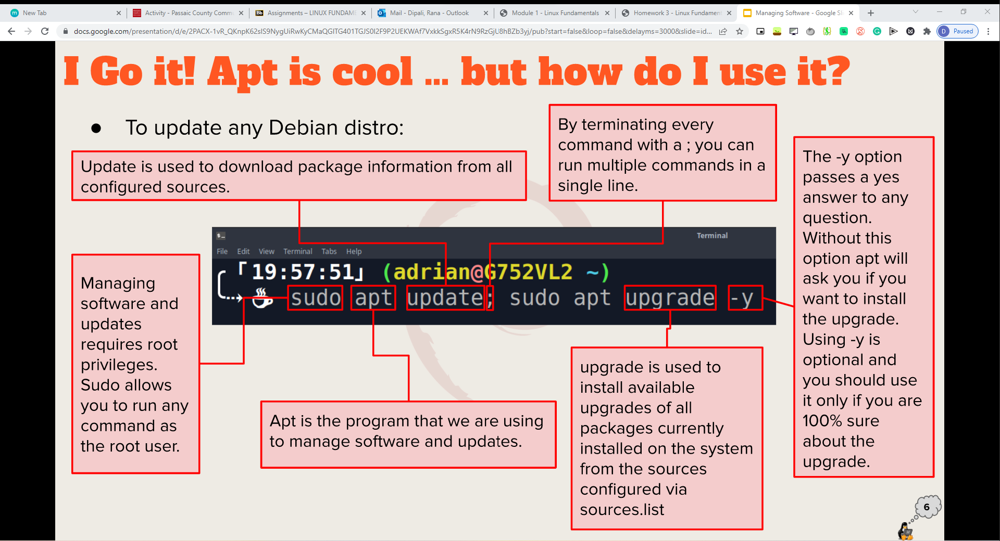
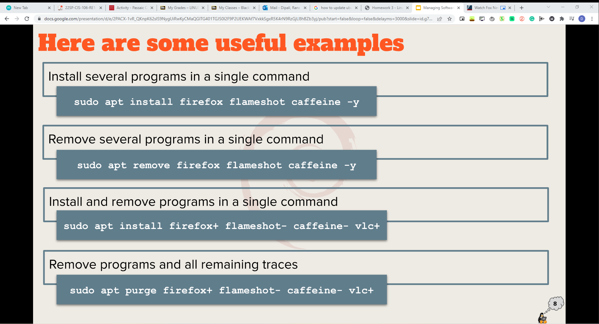
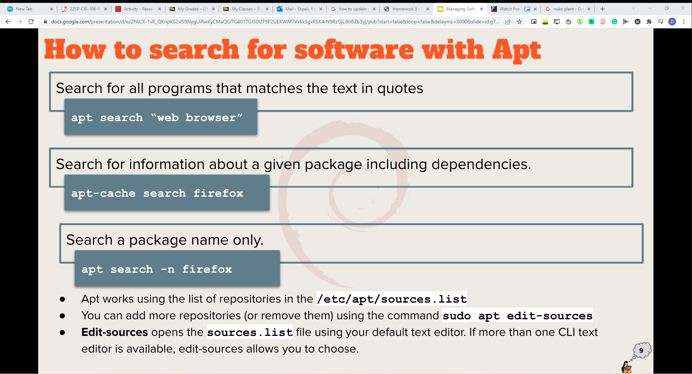

# Weekly Report 3 

## Summary of Presentations

### Exploring Desktop Environments
* Before Desktop Environments (DE), there was Command Line Interface (CLI). 
* **Graphical User Interface (GUI)** - is a set of programs that allows a user to interact with the computer system via icons, windows, and various other visual elements. 
* **Desktop Environment (DE)** - is an implementation of the desktop metaphor made of a bundle of programs running on top of a computer operating system, which shares a common GUI, sometimes described as a *graphical shell*. 
  
#### Elements of a Desktop Environment
* **Desktop Settings** - consist of programs that allow you to make configuration changes to the desktop environment. 
* **Display Manager** - allows you to choose between the desktop environment, and users. 
  * Display Manager = Login Screen)
* **File Manager** - this program allows you to perform file maintenance activities graphically.
* **Icons** - is a picture representation of a file or program
* **Favorites Bar** - the window area that contains popular icons, which are typically used more frequently. It can be removed or added as desired. 
* **Launcher** - this program(s) allows you to search for applications and files. It can also allow certain actions, such as start or open, to be performed on the search results. 
* **Menus** - these window areas are typically accessed via an icon. They contain files and/or program lists as well as sublists of additional files and/or programs selections. 
* **Panels** - are slim and typically rectangular areas that are located at the very top or bottom of a desktop environment's main window. They can also be at the desktop's far left or right. 
  * Often contain notifications, system data and/or time, program icons, and so on. 
* **System Tray** - is a special menu, commonly attached to a panel. It provides access to programs that allow a user to log out, lock their screen, manage audio settings, view notifications, shut down or reboot the system, and so on. 
* **Widgets** - are programs that provide to the user information or functionality on the desktop 
  * Are divided into applets, screenlets, desklets, and so on. 
* **Window Manager** - these client programs determine how the windows (also called *frames*) are presented on the desktop. 
  * Control items such as size and appearance of the windows
  * Manage how additional windows can be placed, such as either next to each other or overlapping

#### Different Desktop Environments
* **The GNOME DE** - default desktop in Ubuntu is GNOME 3 and is used by several Linux distributions, like Debian, Fedora, Red Hat, Enterprise Linux, and Oracle Linux. 
  * Official GUI for GNOME3 is **GNOME Shell**
  * GNOME is part of GNU Project 
* **The KDE Desktop Environment** 
* **The XFCE Desktop Environment** - is a lightweight desktop environment that aims to be fast and low on system resources, while still being visually appealing and user friendly
* **The Mate Desktop Environment** - is the continuation of GNOME 2. 
* **The Cinnamon Desktop Environment** - is a free and open-source desktop environment for the X Window System that derives from GNOME3 but follows traditional desktop metaphor conventions. 
  * This is the principal desktop environment of the Linux Mint distribution. 
* **The LXQT Desktop Environment** - is a lightweight Qt desktop environment. 
  * Included in most Linux and BSD distributions
* **The Deepin Desktop Environment** - is the desktop environment of the Chinese Deepin Linux distribution. 
* **The Pantheon Desktop Environment** - is the desktop environment created for the Elementary OS. 
* **The Raspberry Pi OS Desktop Environment**

### The Bash Shell

#### What is a shell? 
* **GNU bash shell** - is a program that provides interactive access to the Linux system.
    * It runs as a regular program and is normally started whenever a user logs in into a terminal 
    * Most Linux distributions use the bash shell as the default shell. Other shells exist like: 
      * Tcsh Shell
      * Csh Shell
      * Ksh Shell
      * Zsh Shell
      * Fish Shell
  
#### Bash shortcuts | Command Editing Shortcuts
* **Ctrl + A** - go to the start of the command line
* **Ctrl + E** - go to the end of the command line
* **Ctrl + K** - delete from cursor to the end of the command line
* **Ctrl + U** - delete from cursor to the start of the command line 
* **Ctrl + W** - delete from cursor to start of word (i.e. delete backwards one word)
* **Ctrl + Y** - paste word or text that was cut using one of the deletion shortcut after the cursor
* **Ctrl + XX** - move between start of command line and current cursor position (and back again)

#### Basic Commands & Their Usage
* **date** - displays the current time and date
*  **cal** - displays a calendar of the current month
*  **df** - displays the current amount of free space on our disk drives
*  **free** - displays the amount of free memory 
*  **uname** - displays information about your system
*  **clear** - clears the screen 

### Managing Software

#### Important to Know
* **Package** - archives that contain binaries of software, configuration files, and information about dependencies
* **Library** - reusable code that can be used by more than one function or program
* **Dependency** - software needed as a foundation for other software. 
* **Repository** - a large collection of software available for downlaod 
* **The Debian Package Management System (DPMS)** - is the foundation for managing software on all Debian distributions
* **Advanced Package Tool (APT)** - is a set of tools for managing Debian packages. 
  * Handles dependencies in software
  * Can do installation resuming
  * Can search for packages using a local cache of the available packages
  * Used for updating all the packages in the system

#### Command for Updating Ubuntu
* To Update any Debian distro: 

**sudo apt update**

#### Command for Installing Software & Removing Software

**sudo apt install 'package name'**
**sudo apt remove 'package name'**

#### Command for Searching for Software 

