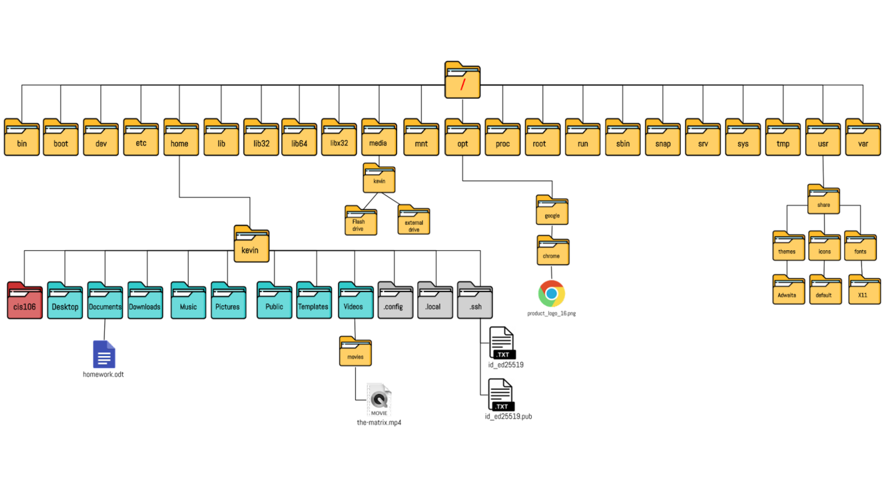
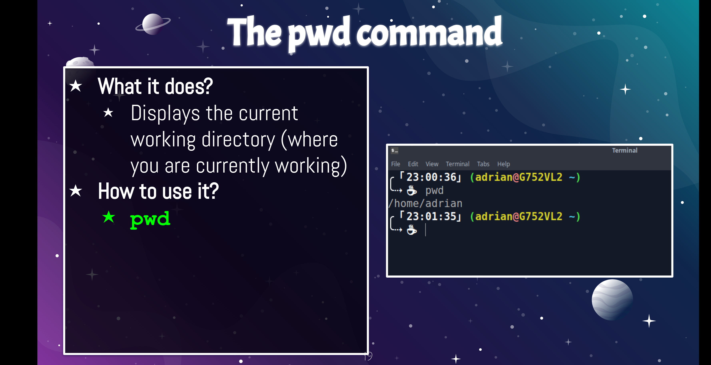
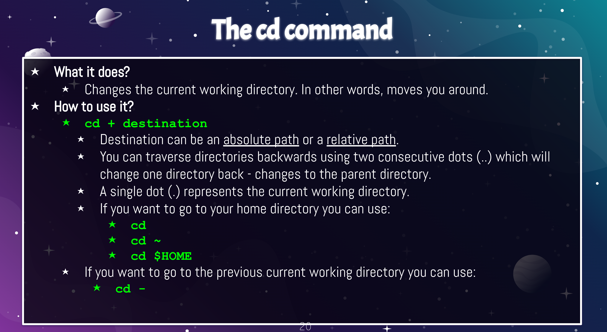
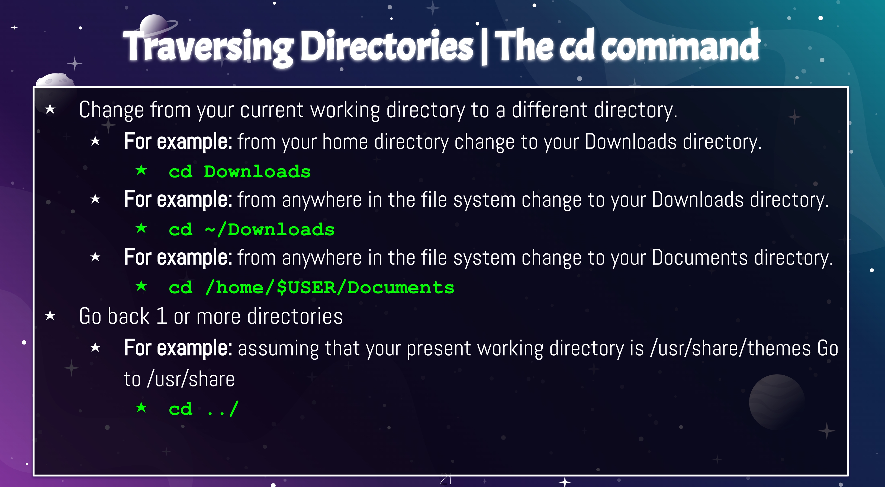
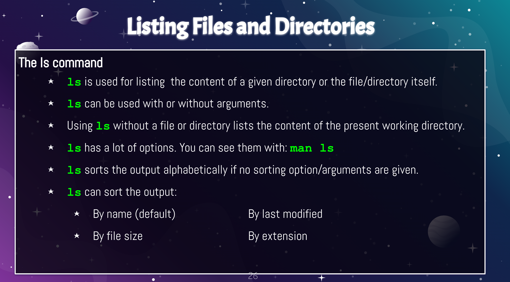
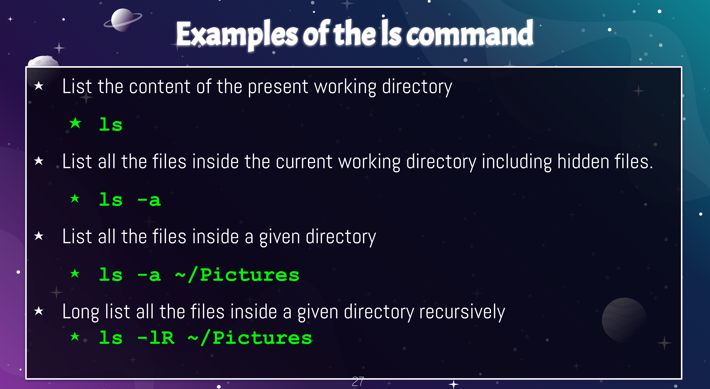
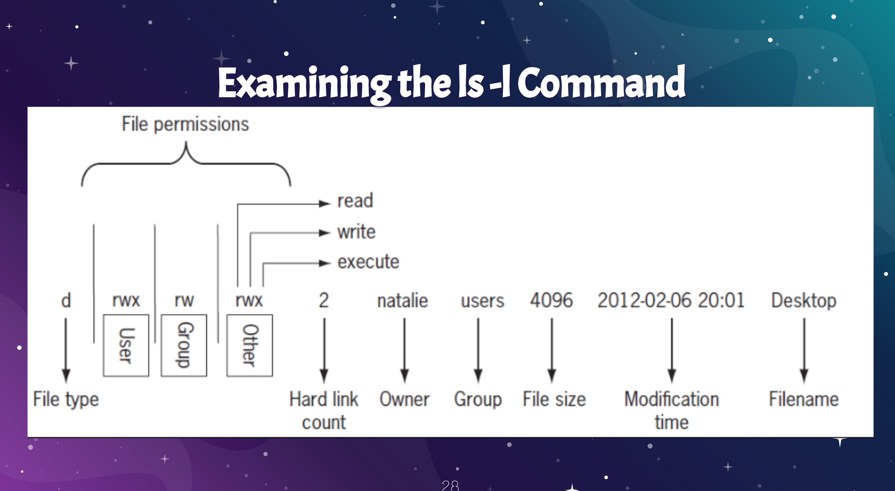
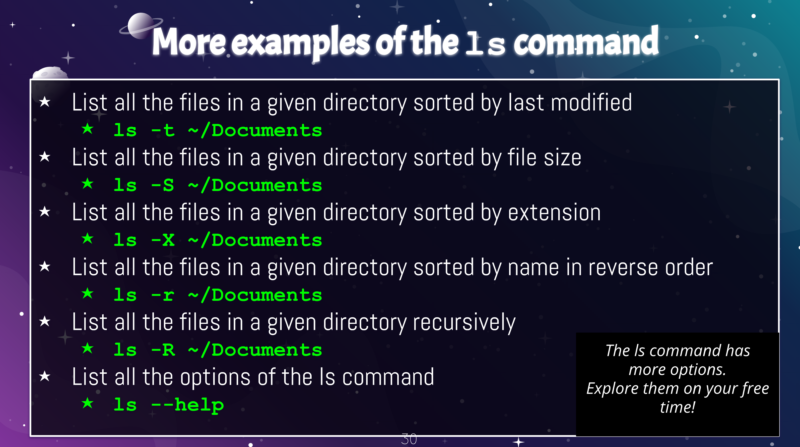

# Weekly Report 4
## How to Navigate the Filesystem 
### The Linux Directory Structure 
* **File system** - the way files are stored and organized to simplify access to data
* **Hierarchical Directory Structure** - Linux organizes its files in a tree-like pattern of folders
* Directory and folder mean the same thing
* **Root Directory** - the first directory in the file system
* **Filesystem Hierarchy Standard (FHS)** - specifies requirements and guidelines for file and directory placement in UNIX-like operating systems. 
* Linux always have a single file system tree
* You work inside a particular directory and can move forward to **subdirectory** OR backwards to the previous directory called a **parent directory**. 
* **Current Working Directory or Present Working Directory** - the directory where you are at the moment 
* **Difference between your home directory and the home directory**:
  * When you open your terminal emulator, your current working directory is your **home directory**.
  * When you open the file manager, your current directory is your **home directory**. 
  * Every *user* has a home directory. 
  * The **root user** is the administrator of your system.
    * To obtain root privileges, we use the *sudo command* which grants temporary full administrator privileges.
* To sum up: 
  * The phrase **"your home directory** refers to your user's home directory. 
    * Example: /home/adrian is the home directory of the user adrian.
  * The phrase **"the home directory** refers to the home directory located in the root. 
    * Example: /home

### Pathnames
* **Pathnames** - indicates the location of the file in the filesystem (like an address)
* Types of Pathnames: 
  * **Absolute Path** - the location of a file starting the root of the file system. 
    * Example: /home/john/Downloads/song.mp3
    * Always starts with the /
  * **Relative Path** - the location of a file starting from the current working directory or a directory that is located inside the current working directory. 
    * Example: Downloads/song.mp3
    * Starts with a subdirectory 

## How the filesystem looks like conceptually

## Navigating the Filesystem in the CLI 
* **the pwd command** - used for displaying the current working directory 
* **the cd command** - used for changing the current working directory. 
  * When no directory is given, cd changes the current working directory to the home directory of the current user.
* **the ls command** - used for displaying all the files inside a given directory. 
  * When no directory is specified, ls displays the files in the current working directory. 

### The pwd command

### The cd command

#### Traversing Directories | The cd command

#### Bash Features
* **Tab Completion** - autocompletes a command by pressing the tab key
* **Arrow keys** - allows you to move, edit, and repeat commands
* **Ctrl + a** - go to the start of the command line
* **Ctrl + e** - go to the end of the command line

## Listing Files and Directories 

### Examples of the ls command

### Examining the ls -l command

* Contains important information in eight separate columns
  * **File type** - "d," which stands for directory
  * **File Permissions** - displayed for three categories: user, group, and other
  * **Hard links** - number of hard links associated with the file
  * **Owner** - user owner of the file
  * **Group** - file's group owner
  * **File size** - in bytes by default
  * **Modification time** - timestamp showing when the file was last modified
  * **Filename** - name of the file

## Right to Repair Movement
**What is the right to repair movement and why does it matter?**
The right to repair movement is having manufacturing companies allow repair tools and/or spare parts to assist consumers fix their own devices either by themselves or by a 3rd party vendor rather than purchasing a replacement product. It matters because it would give more power to the consumer to choose cheaper, affordable options to fix their devices. 

It also matters because we want items to last longer so it would be nice to get that knowledge from the manufacturer so the consumer does not have to buy another expensive product to replace that item. There has been proposed legislation to give more power to consumers and is slowly changing the tech landscape. 