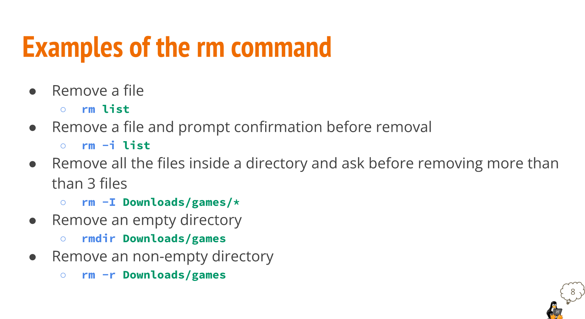
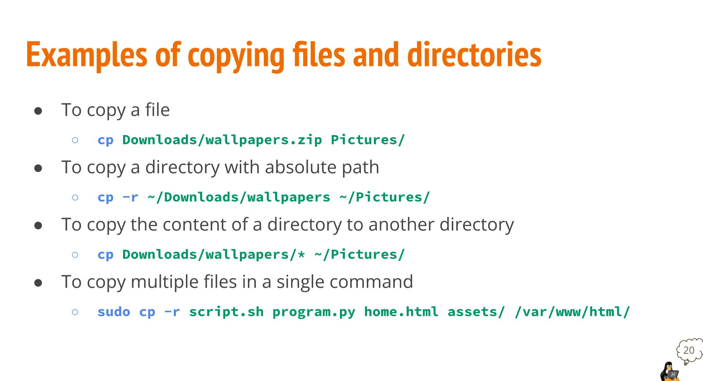

# Weekly Report 5
## Handling Text Files
* **mkdir command** is used for creating a single directory or multiple directories
    * To create a directory with mkdir type: 
      * Formula: **mkdir + name of the directory**.
    * To create *multiple* directories, separate each directory name with a space.
    * You can create directories by using absolute path or relative path.
    * You can create a directory with a space in its name using the escape character (\) or by surrounding the name in quotation marks ('' or " ").

* **touch command** is used for creating files. 

  

* **rm command** removes files.
  * rm by default does not remove directories. To remove a directory, you must use rm with the -r option. 
  * In Linux and other Nix systems you cannot remove non empty directories. 

* **rmdir command** is to remove empty directories.
  * To remove non-empty directories use rm -r + directory name or directory absolute path. 

* **mv command** moves and renames directories. 
  * Formula: **mv + source + destination**
  * Where source is the file or directory that you want to move and destination is where the directory or file is going. 
  * For renaming files/directories the formula remains the same:
  * Formula: **mv + file/directory to rename + new name**
  * Both source and destination can be an absolute path or relative path.

* **cp command** copies files/directories from a source to a destination. 
  * Formula: **cp + files to copy + destination**
  * To copy directories  you must use the -r option
  * Formula: **cp -r + directory to copy + destination**

* Hard Links: **Ln command** are files that point to data on the hard drive. 
  * When you create a file, it's automatically linked to the data stored in the hard drive and it is assigned an inode number. 
  * Hard links must be created on the same partition. 
  * If you change data on any link, all hard links are changed because the data on the hard drive was changed. 
  * Formula: **ln file ~/Downloads/fileHL**

* Soft Links: **Symbolic links command** are a special type of file that point to other files instead of data in the hard drive. 
  * Soft links do not share the same inode number as hard link do. 
  * The advantage of soft links is that they can point to files that are stored on different partitions. 
  * If you modify a soft link, the target file is modified too. 
  * Formula: **ln -s file fileSL**

* **man command** man (manual) pages are documentation files that describe Linux shell commands, executable programs, system calls, special files, and so forth. 
  * Man are quick references, not step-by-step guides. 
  * Formula: **man + command**
    * Example: man ls
  * To navigate the man page of a command, you can use the arrow key or the man command internal shortcuts.
  * To exit the man page press letter "q". 

## Brace Expansion & How To Use It
* **Brace expansion {}** is a feature of bash that allows you to generate arbitrary strings to use with commands. 

