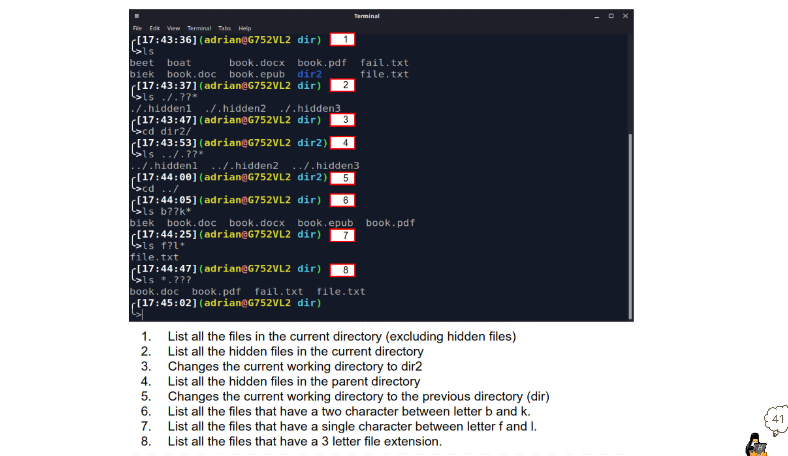

# Weekly Report 6
## Using Wildcards (File Globbing)
* Wildcard represents letters and characters used to specify a file name for searches.
* **File globbing** - is the process of pattern matching using wildcards. 
* Wildcards are officially called metacharacter wildcards.
  * Examples of using wildcards:
    * Get a long list of all files in the current directory starting with "new"
    * Manage directories faster
    * Move or delete a group of files
    * Locate files based on a portion of their filenames
    * Create files and directories quicker 
  * Wildcards are not regular expressions. A *regular expression* is a sequence of characters that define a search pattern. 

### The * Wildcard
* The main wildcard is a star, or asterisk (*) character.
* A star alone matches anything and nothing and matches any number of characters. 
  * For instance, **ls *.txt** will match all files that end in .txt regardless of the size of the file name. 
  * Examples of when to use the * wildcard: 
    * When you want to list all files with a particular file extension
    * When you do not remember the complete name of a file but you remember a portion of the name
    * When you want to copy, move, or remove all files that match a particular naming convention 

### The ? Wildcard
* The ? wildcard metacharacter matches **precisely one character**. 
* The ? wildcard proves very useful when working with hidden files (a.k.a *dot files*)
  * Example:
    * To list all hidden files use: ls .??* which will match all files that start with a . or .. and have any character after it. 

#### Breakdown of ls-1X command

### The [] Wildcard
* The brackets wildcard match a single character in a range. 
* The brackets wildcard use the exclamation mark to reverse the match. 
  * For instance, match everything except vowels [!aeiou] or any character except numbers [!0-9].
  

#### Breakdown of ls -1 command 

### Quick Reference of Using Wildcards/File Globbing

### Using Brace Expansion 
* Brace expansion {} is **not** a wildcard but another feature of bash that allows you to generate arbitrary strings to use with commands.
  * Examples: 
    
    

