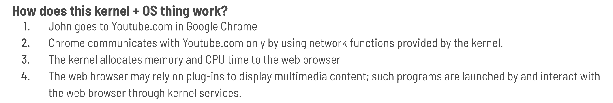
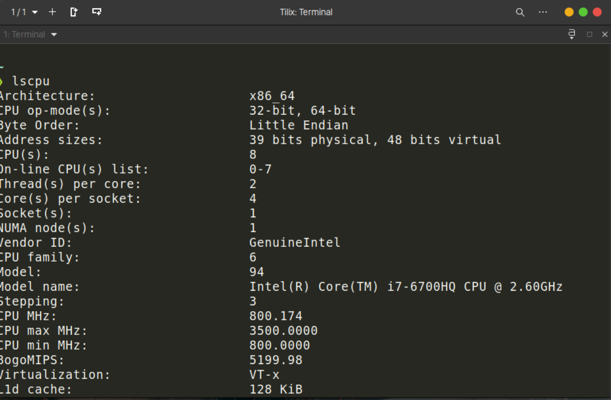
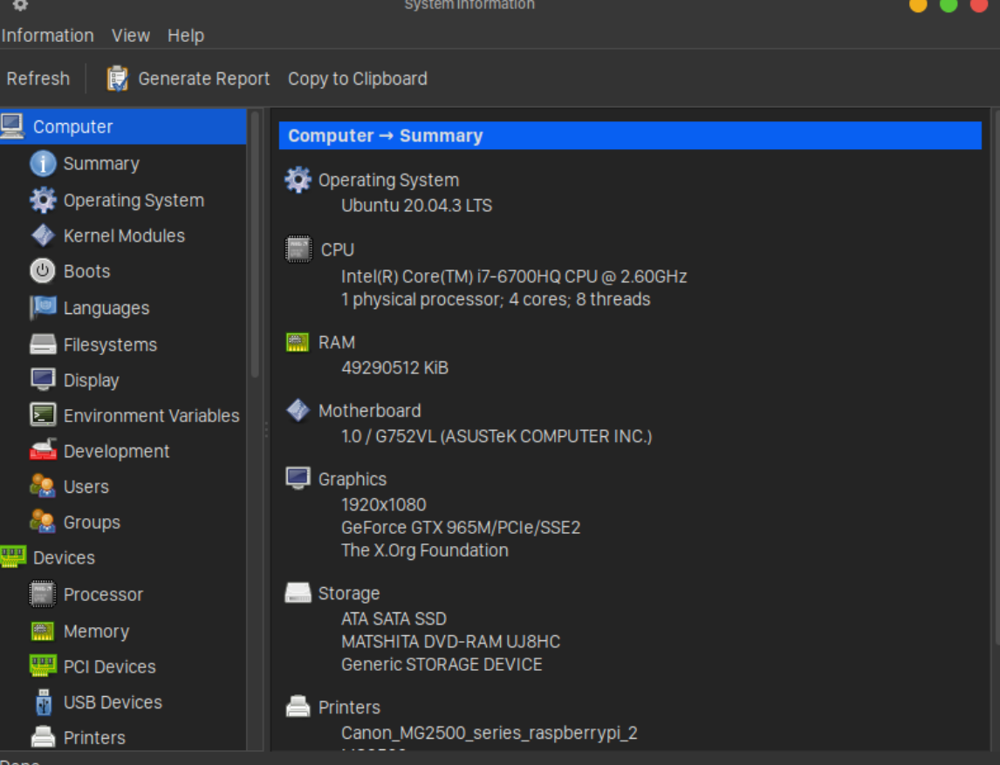
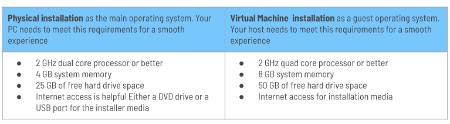
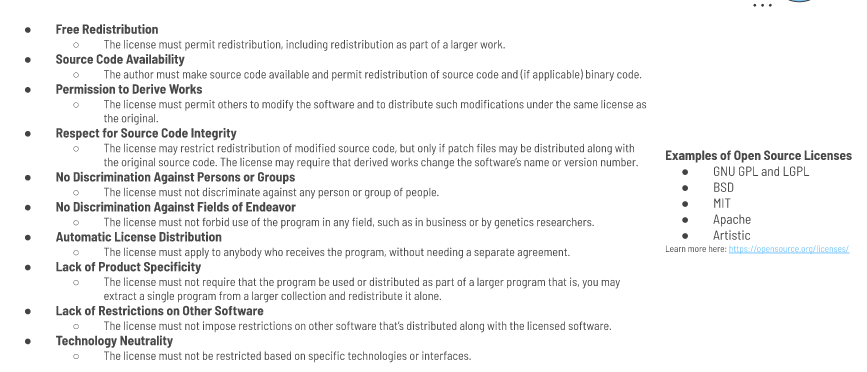

# Week Report 1 

## Summary of Presentation: Introduction to Linux 

### Operating System
  * **operating system** - provides all fundamental software features of a computer 
    * All of the features relay on the OS's kernel 
  * **kernel** - is a software component that's responsible for managing low-level features of the computer, including the following managing system hardware, memory allocation, CPU time, and program to program interaction. 

    * Example
        

    * The kernel is the software "glue" that holds the computer together.
    * Cannot be interchangeable; Linux is different from Windows & Mac's kernel. 
  * ### What else identifies an OS? 
    * **command-line shells** - this was the de facto way of using computers before the Graphical Interface was invented and it works by typing commands in a shell.
    *  **graphical user interfaces** - rely on icons, menus, and a mouse pointer for the user interaction. 
    *  **utility and productivity programs** - tools like web browsers, document processors, and text editors.  
    *  **libraries** - are collections of programming functions that can be used by a variety of programs. 

    #### User Interfaces

    Example of Command Line Interface

    

    Example of Graphical User Interface

    

    ### What is Linux? 
    * Linux is a Unix-like Operating System.
    * Consists of a kernel, libraries, and utilities
    * Is available in many distributions (any operating system that runs the Linux kernel)
      * Ex. Arch, Cent)S, Debian, Fedora, openSUSE, Red Hat, Slackware, Ubuntu and many more. 
    * Is open source software
    * Is available free of charge
    * Includes many of the Unix tools
    * Highly scalable and customizable 
    * Majority of server applications on the internet run on some version of Linux
    * You can install on almost any system as it supports almost every processor architecture

### System Requirements

* Can install Linux:
  * Alone as the only OS on the computer
  * Side by side with another OS
    * Dual Boot
  * In an emulated computer environment provided by a virtualization 
    * Via Virtualbox, VMware Workstation, Microsoft Hyper-V
  * Via Windows Subsystem for Linux
    * Available for developers who want a Linux system inside Windows

### Where does Linux fit in the OS World? 
#### The concept of Unix-like operating system
* A Unix-based or Unix-like operating system is designed to function and behave similar to the Unix operating system. 
  * Examples of proprietary Unix-like operating systems include AIX, HP-UX, Solaris, and Tru64. 
  * Examples of open-source Unix-like operating system are those based on the Linux kernel and BSD derivatives, such as FreeBSD and OpenBSD
  * Supports multiple users, strict segregation between kernel and user processes, preemptive multitasking, and a hierarchical file system
  * Share the characteristic known as "everything is a file"
  * **GNU toolchain** is a collection of compilers, libraries, debuggers, and core utilities modeled on Unix. 
  * Single Unix Specification and POSIX standards help to establish a common set of commands and behaviors across Unix-like operating systems.

#### Comparing Linux to Mac OS
* Mac OS is a commercial Unix-based OS derived from BSD with its own user interface. 
* Apple makes OS X available for its own computers. Installing it in other computers is a violation of EULA. 

### Comparing Linux to Windows 
* **Licensing** Linux is an open source OS, whereas Windows is a proprietary commercial OS
* **Costs** Many Linux varieties are available free of charge
* **Hardware Compatibility (drivers)** Most hardware manufacturers provide Window drivers. Some manufacturers provide Linux drivers but most come from the community and tends to be supported for longer periods of time. 
* **software availability** Most desktop applications are written for Windows. Popular server programs were developed first for Linux or Unix and overtime for Windows. 
* **User Interfaces** Windows uses its own unique user interface. Where as Linux gives the user many choices to pick from
* **Configurability** Linux is much more configurable OS than Windows. Windows limits the suer to what the licenses permits. 

### What is a Distribution?
* **Linux Distribution** - a complete Linux system package
  * The elements that make up a Linux Distribution: 
    * A Linux Kernel
    * Core Unix Tools
    * Supplemental Software
    * Startup Scripts
    * An Installer

### Common Linux Distributions: 
* Debian
  * Ubuntu
    * Pop OS
* Redhat
  * Fedora
    * Alma Linux
* Slackware
  * Absolute Linux
* Arch Linux
  * Manjaro

### Ubuntu
* **Ubuntu** - is a Linux distribution, freely available with both community and professional support. 
  * Ubuntu Manifesto:
    * The software should be available free of charge
    * The software tools should be usable by people in their local language and despite any disabilities
    * People should have the freedom to customize and alter
    * Their software in whatever they see fit

#### Ubuntu Release Cycles
* **Regular or Non-LTS**: Shipped every six months and supported for 9 months
* **LTS (Long-Term Support)**: Shipped every two even years and is supported for 5 years. 

### What is Debian? 
* **Debian** - is an all-volunteer organization dedicated to developing free software and promoting the ideals of the Free Software community 
  * Known to be the Grandfather of all linux distributions alongside Slackware and Open Suse 

* Examples of Linux Distributions based on Ubuntu: 
  * Linux Lite 
  * Linux Mint
  * Elementary OS
  * Pop OS
  * Zorin OS
  * Peppermint

* Examples of Linux Distributions based on Debian: 
  * Linux Mint
  * Kali Linux 
  * Parrot OS
  * Linux Deepin
  * MX Linux 
  * SteamOS

### Software Licensing 
* Software is a type of intellectual property that is governed by copyright laws and, in some countries, patent laws. 
* Open source software, relies on licenses, which are documents that alter the terms under which the software is released. 
* Types of licensing agreement: 
  * **Open Source** the software may be distributed for a fee or free. The source code is distributed with the software. 
  * **Closed Source** the software is not distributed with the source code. The user is restricted from modifying the code. 
    * **Freeware**: the software is free but the source code is not available 
    * **Shareware**: the software is free on a trial basis 
  * **Free software**: the software is distributed with the source code. The software can be free of charge or obtained by a fee. 
  * The Free Software Foundation (FSF) is a critical force in the open source world.
    * Founded by Robert Stallman, the FSF is driving force behind the GNU project. 
    * The FSF defines four specific software freedoms: 
      * Freedom 0: use software for any purpose
      * Freedom 1: examine the source code and modify it as you see fit
      * Freedom 2: redistribute the software 
      * Freedom 3: redistribute your modified software

### The Open Source Software Definition

### How does open source make money? 
* **Services and Support**: the product itself can be open source, and even given away for free, while the company sells, services, and support
* **Dual Licensing**: A company can create two versions of the product - one version is completely open source, and another adds features that are not available in the open source version. 
* **Multiple Products**: The open source product may be just one offering from the company, with revenue being generated by other product lines. 
* **Open Source Drivers**: A special case of the preceding one is that of hardware vendors. They might opt to release drivers, or perhaps even hardware-specific applications, as open source as a way to promote their hardware. 
* **Bounties**: Bounties are a crowdfunding method. Users can drive open source creation by offering to pay for new software or new features in existing software. 
* **Donations**: Many open source projects accept donations  to help fund development 

## Final Project Research Questions and Answers
* a. What is the problem that you are trying to solve with this project? 
  **The problem I am trying to solve with this project is to host a simple website in Ubuntu Server using Apache/NGINX. Web hosting is important because it allows an organization or individual to post a website or web page onto the Internet, and once the website is hosted on the computer they are called servers. When the user want to view your website, all they need to do is type in the web address or domain into the browser. The computer will then connect to the server and the webpage will be delivered via the browser. Hence, web hosting is an essential step in web development because the website should be delivered to the user.**

* b. What are the names of the technologies involved? 
  **The names of the technologies involved are Apache, Ubuntu, Linux, Debian, Fedora, and Red Hat Enterprise Linux.**

* c. What are the system requirements for the project? 
* **The system requirements is a virtual machine installation. The Virtual Machine installation requirements needed for this project is 2 GHz quad core processor or better, 8 GB system memory, 50 GB of free hard drive space, and Internet access for installation media.**
